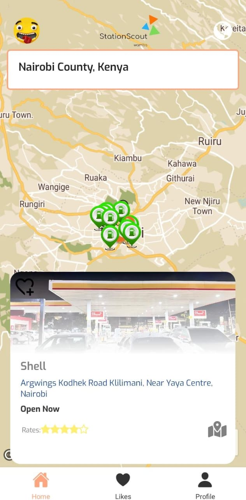
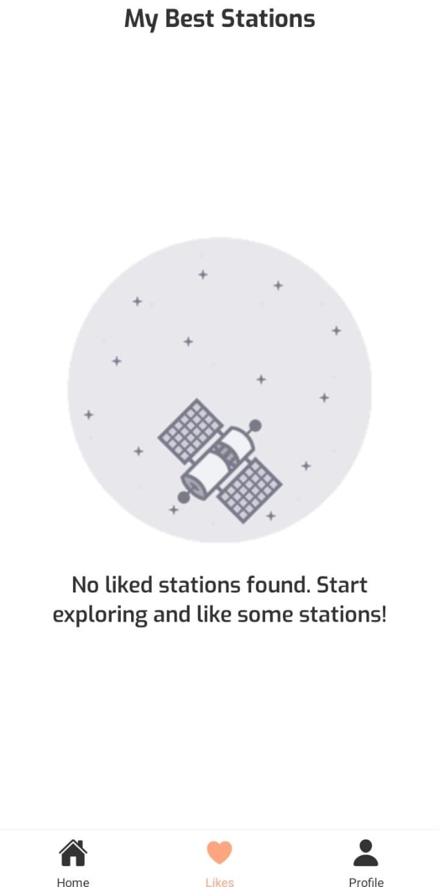
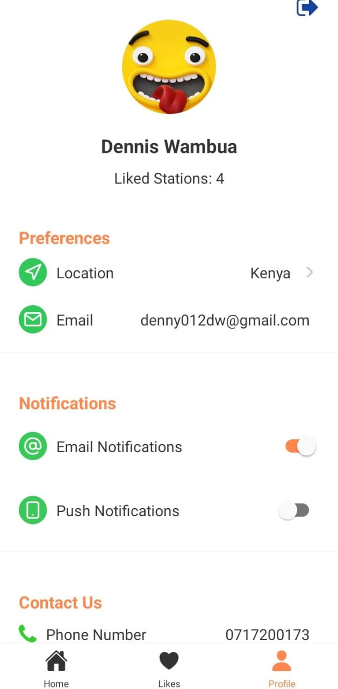

# StationScout

StationScout is a mobile application developed as a final year project, designed to help users find nearby gas stations quickly and efficiently. The app utilizes modern technologies and APIs to provide real-time location-based information and features a user-friendly interface.

## Images

    
    
    

## Features

- **Location-based Search:** Users can search for nearby gas stations based on their current location.
- **Real-time Data:** Provides up-to-date information on station locations, operating hours, and services.
- **User Authentication:** Integrates Google authentication for secure and personalized user accounts.
- **Theme Customization:** Supports both light and dark themes based on user preference.
- **Liked Stations:** Allows users to save and manage their favorite stations for quick access.
- **Profile Management:** Users can manage their profiles and preferences within the app.

## Technologies Used

- **React Native:** Framework for building native mobile applications using JavaScript and React.
- **Expo:** Toolchain and platform for React Native applications, providing ease of development and deployment.
- **Firebase:** Backend services for authentication, database management, and cloud storage.
- **Clerk:** Integration for user authentication and management.
- **Google Maps API:** Provides mapping and location-based services for displaying station locations.
- **AsyncStorage:** Local storage for persisting user data such as liked stations.

## Installation

To run the StationScout app locally, follow these steps:

1. Clone the repository from [GitHub Repository URL].
2. Install dependencies using `npm install` or `yarn install`.
3. Configure environment variables for Firebase and Google API keys as specified in `.env` file.
4. Run the app using `expo start` or `npm start`.

## Usage

- Ensure location services are enabled on your device.
- Sign in with your Google account to access personalized features.
- Use the search functionality to find nearby gas stations.
- Tap on a station to view details and directions.
- Save your favorite stations by liking them for quick access.

## Contributing

Contributions are welcome! If you find any issues or have suggestions for improvements, please open an issue or create a pull request on [GitHub Repository URL].

## License

This project is licensed under the [License Name] License - see the [LICENSE.md](LICENSE.md) file for details.
